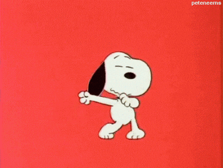

# :tada: My Portfolio :tada:

I just realized recently I do not have a portfolio :flushed: 
*(well, it depends on when you are seeing this or recent will be past :see_no_evil:)* 
See my second commit  :point_up: that is exactly when I realized this.  
But seriously who doesn't have a portfolio somewhere? Not me, because here is mine :wink:

## :raising_hand: Why so many emojis?
:one: Because I can :muscle:  
:two: It's just a portfolio.  
:three: They look so good especially in commits. I made a point of using emojis in each and every commit i make *expect for initial, which was made ages ago* 

### Disclaimer
:four: The emojis do not really relate to what i did in the files changed but there are the closest i could get *with my small creative mind* :smiley:  
:five: This project is built with simple html and css. Its not even the best there is but hey, it works fine and I now have a portfolio don't I? :raised_hands:  

 
:three: They look so good especially in commits. I made a point of using emojis in each and every commit I make *expect for initial, which was made ages ago* 

### Disclaimer
:four: The emojis do not really relate to what I did in the files changed but there are the closest I could get *with my small creative mind* :smiley:  
:five: This project is built with simple html and css. Its not even the best there is but hey, it works fine and I now have a portfolio don't I? :raised_hands:  

 
</div

## Reuse
I would love to see some contributions but you do not know me so you cannot contribute to this :pensive:  
However if for whatever :confused: reason you might be interested in reusing my code, feel free to :fork_and_knife:  
  
## Issues
If you have anything to say maybe:
- My sense of humor is wanting :speak_no_evil: 
- A correction of an emoji I have used wrongly *I am sure there are a bunch of these*   
- You think this is a great documentation  :stuck_out_tongue_winking_eye:  

Open an issue and I may or not consider your concerns, critics and feedback. :grinning: but  
i promise i will def take a look :coffee:  
Open an issue and I may or may not consider your concerns, critics and feedback. :grinning:  
But I promise I will def take a look :coffee:  

  ***
This is hosted on github just scroll :arrow_up: and under description you will see a link to my  :page_facing_up:  
I would have put a link here but I just don't want to :expressionless:

I get my emojis [here](https://www.webpagefx.com/tools/emoji-cheat-sheet/). You are welcome :neckbeard:  
[Here](https://www.webpagefx.com/tools/emoji-cheat-sheet/) is where i get my emojis from. You are welcome :neckbeard:  

Mail me: [:envelope:](mailto:cessmbuguar@gmail.com') 

